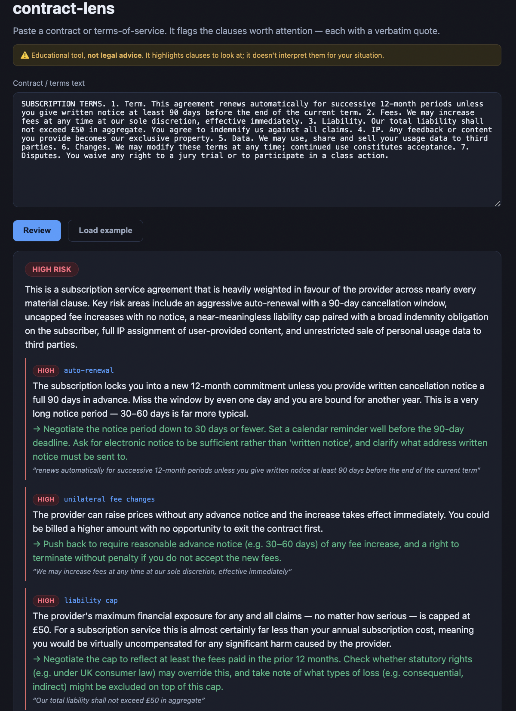

# contract-lens

### ▶ Live demo: **[contract-lens.kareemghazal.com](https://contract-lens.kareemghazal.com)**

Paste an agreement (or "Load example") and get the risk verdict and clause-by-clause findings with
quotes. (First run ~10–20s.)



> **Educational tool — not legal advice.** It highlights clauses to look at; it doesn't interpret
> them for your situation. Consult a qualified lawyer for anything that matters.

Paste a contract or terms-of-service; it flags the clauses a careful person should pay attention to
before signing — **auto-renewal, liability caps, indemnification, IP/content assignment, broad data
rights, unilateral change-of-terms, arbitration/class-action waivers** — each with a **severity** and
a **verbatim quote** from the document.

Built the same way as the other reviewers in this set: every finding is **grounded** — a pass drops
any finding whose quote isn't actually in the document, so it can't invent a clause. And it's gated
by a **planted-clause eval set**: a deliberately one-sided contract it must catch, and a fair,
balanced one it must **not** cry wolf on.

## Quickstart

```bash
pip install -e .
cp .env.example .env   # add ANTHROPIC_API_KEY

contract-lens demo                 # review a baked-in one-sided subscription contract
contract-lens review --file terms.txt
```

## Evals

```bash
python evals/run_evals.py             # recall / precision / grounding + an opus judge
python evals/run_evals.py --no-judge
```

- **Recall** — on a loaded contract, it surfaces a solid share of the planted risky clauses.
- **Precision** — on a fair, balanced contract, it raises no `high` findings.
- **Grounding** — every quote appears in the document.
- **Judge** — opus scores correctness, usefulness and calibration (and that it doesn't overstep into
  legal advice).

## Tests

```bash
pytest -q   # offline: the grounding pass drops fabricated quotes (fake client, no API key)
```

## Web

`web/` — a Next.js UI: paste an agreement, get the risk verdict and clause-by-clause findings with
quotes, and the not-legal-advice banner throughout. See [DEPLOY.md](./DEPLOY.md).

## License

MIT — see [LICENSE](./LICENSE).
